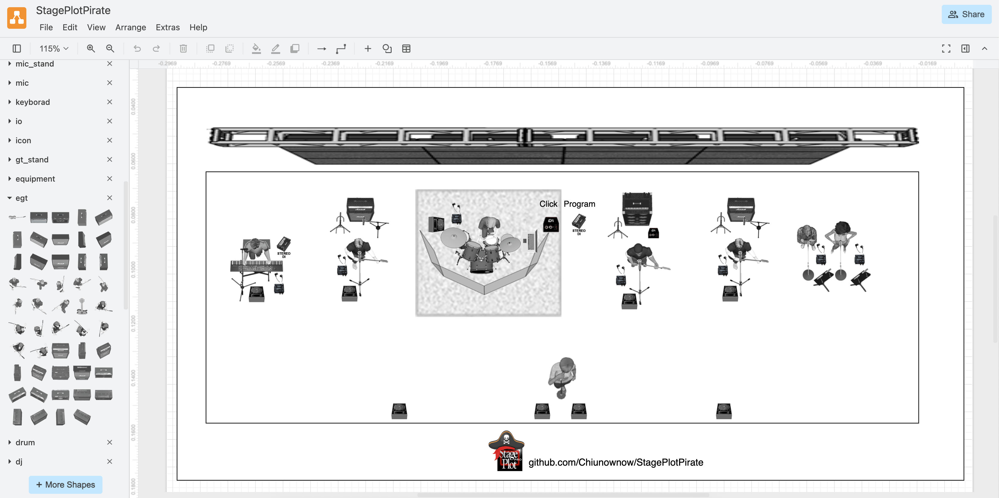
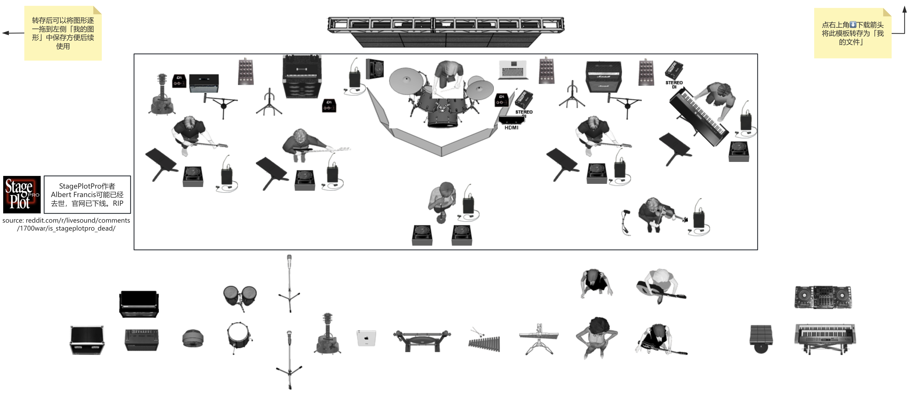

# StagePlotPirate

> Create stage plots in draw.io using StagePlotPro assets

[English](README.md) | [简体中文](README_CN.md)

StagePlotPro was a highly regarded tool among stage engineers and live band performance teams, celebrated for its simplicity and efficiency. Unfortunately, its creator, [Albert Francis, may have passed away](https://www.reddit.com/r/livesound/comments/1700war/is_stageplotpro_dead/) (may he rest in peace), and the official purchase channels have been discontinued, making this excellent software inaccessible.

To preserve its vital role in live performance work, we have ported the original software's image assets to draw.io. This modern solution allows users to create professional stage plots while honoring and extending the legacy of StagePlotPro.

---

## How to Use

### Method 1: Import Template and Libraries (Web Version)
> Note: This method will replace the default templates in draw.io.
1. Open [this link](https://app.diagrams.net/#_CONFIG_NY1LCsMwDERP460X6SLrfsg60BOorhoL/AmWTHL8jguFYZ4GIY2bb26ajPOeyHiRxIjucoVHs11/4wI1OvwmFvurK7dQi3ExH2rG7h6ll3pACE+jjddUbZWGl+OUPwpEpvdgJimAtgD/N6s/cxrV8+ML) and select the "StagePlotExample" template to create a new drawing.
2. If the libraries do not appear on the left sidebar, go to **Menu - Extras - Configuration** and check if the configuration has been imported.
3. If the configuration is imported but not applied, click **Preferences - Reset**, then refresh the page.

### Method 2: Import Libraries Only (Web Version)
1. Open [this link](https://app.diagrams.net/#_CONFIG_zdjNboMwDAfwp+HaAxPqeaPaaYdK086TCS7xSj4WO6N9+wE97LIH+EsIOR+KfnLARDTHl6ZtR75Qna2vaim8yVCoCOs60Dw9N90248Ob5bWnWzvarn3db4WWwyTm61CVi0vRONrBpbCP9l5qTMt67c13o4nPc7KzFDJ+LMAX3QPPND6iQBL3QN06zflM496kyQ63MG+mtocAzdnTwGiqUtKCRjJRsDQNpIolcj5JwSKN/COOwUxfYJ5SA5aI0Qolf1fJYVsfijXZpxrFEUsl6/JgooTlufJ9SIXA9i2IgwMhPt8hRbEE9qELVTGzFWvgIo5mLFbmEY9UXFUVtOqZhSJYAc1zdVcwUloYrCYo3bJPEez4q0xgxyiVOMHtXWa6wqGsrKkCM92jeSyS0TCDvXSL/J0LutMDxXFz/vvDzErl5nj6BQ==) to create a new drawing with any template.
2. If the libraries do not appear on the left sidebar, go to **Menu - Extras - Configuration** and check if the configuration has been imported.
3. If the configuration is imported but not applied, click **Preferences - Reset**, then refresh the page.

### Method 3: Manually Import Libraries (Web Version)
> Note: Library assets are hosted in this repository.
1. Go to the [scratchpad folder](https://github.com/Chiunownow/StagePlotPirate/tree/main/scratchpad).
2. Copy the XML Raw link of the desired library.
3. In draw.io, navigate to **Menu - File - Open Library From - URL**, paste the link, and open it.

### Method 4: Import Local Library XML (Web and Desktop Versions)
> Note: Library assets are hosted in this repository.
1. Download the repository ZIP file from [this link](https://github.com/Chiunownow/StagePlotPirate/archive/refs/heads/main.zip) and extract it.
2. In draw.io, navigate to **Menu - File - Import Library From - Device**, and import each XML file from the `scratchpad` folder.
3. Once imported, you can delete the downloaded files from your local storage.

---

Also you can try [StagePlotLite](https://www.processon.com/view/link/6761e0c85e3c90729eb487dc?cid=6761d3a9f08dd01c527936ff) on ProcessOn