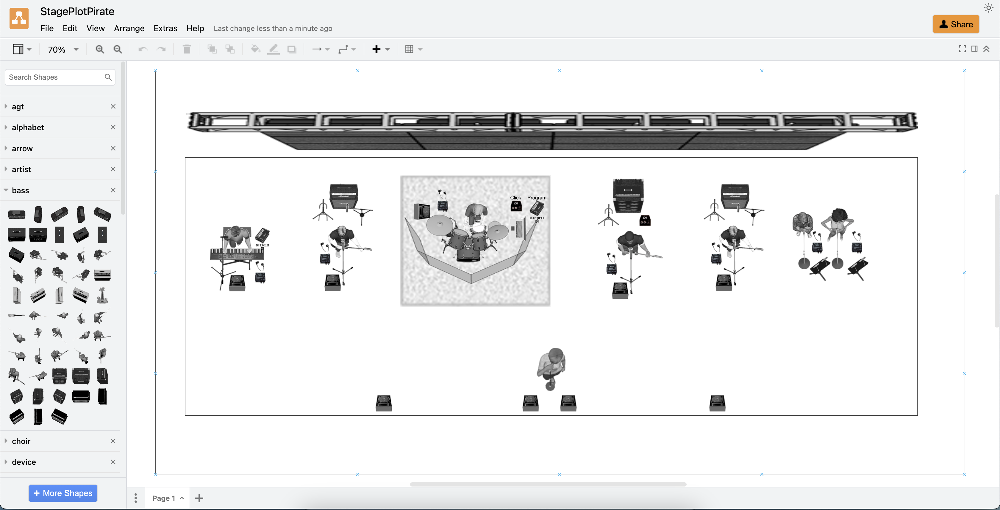

# StagePlotPirate

> Create stage plots in draw.io using StagePlotPro assets

[English](README.md) | [简体中文](README_CN.md)

StagePlotPro was a highly regarded tool among stage engineers and live band performance teams, celebrated for its simplicity and efficiency. Unfortunately, its creator, [Albert Francis, may have passed away](https://www.reddit.com/r/livesound/comments/1700war/is_stageplotpro_dead/) (may he rest in peace), and the official purchase channels have been discontinued, making this excellent software inaccessible.

To continue its vital role in live performance work, we have ported the original software's image assets to draw.io. This modern solution allows users to create professional stage plots while honoring and preserving the legacy of StagePlotPro.

---

## How to Use

### Method 1: Quick Configuration Import
1. Open [this configuration file link](https://app.diagrams.net/?src=about#_CONFIG_zdjNboMwDAfwp+HaAxPqeaPaaYdK086TCS7xSj4WO6N9+wE97LIH+EsIOR+KfnLARDTHl6ZtR75Qna2vaim8yVCoCOs60Dw9N90248Ob5bWnWzvarn3db4WWwyTm61CVi0vRONrBpbCP9l5qTMt67c13o4nPc7KzFDJ+LMAX3QPPND6iQBL3QN06zflM496kyQ63MG+mtocAzdnTwGiqUtKCRjJRsDQNpIolcj5JwSKN/COOwUxfYJ5SA5aI0Qolf1fJYVsfijXZpxrFEUsl6/JgooTlufJ9SIXA9i2IgwMhPt8hRbEE9qELVTGzFWvgIo5mLFbmEY9UXFUVtOqZhSJYAc1zdVcwUloYrCYo3bJPEez4q0xgxyiVOMHtXWa6wqGsrKkCM92jeSyS0TCDvXSL/J0LutMDxXFz/vvDzErl5nj6BQ==) to load all libraries.
2. If the libraries do not appear on the left sidebar, go to **Menu - Extras - Configuration** and check if the configuration has been imported.
3. If the configuration is imported but not applied, click **Preferences - Reset**, then refresh the page.

### Method 2: Manual Library Import
1. Go to the [scratchpad folder](https://github.com/Chiunownow/StagePlotPirate/tree/main/scratchpad).
2. Copy the XML Raw link of the desired library.
3. In draw.io, navigate to **Menu - File - Open Library From - URL**, paste the link, and open it.