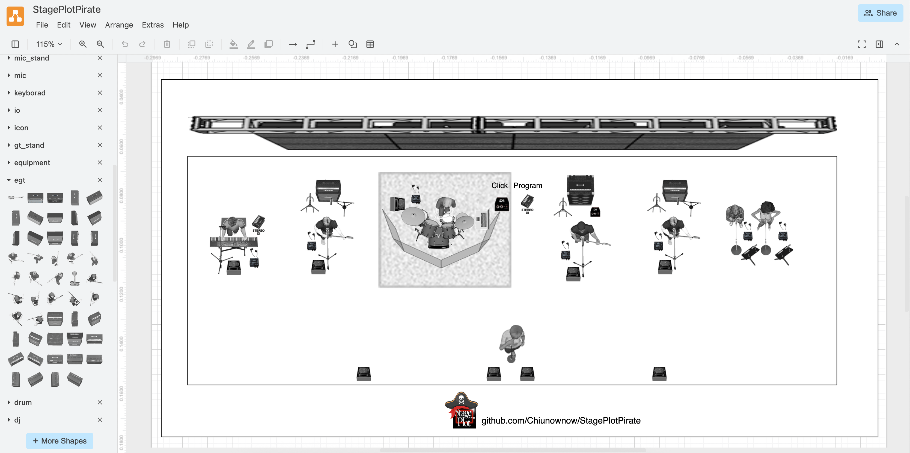

# StagePlotPirate

> 使用 StagePlotPro 的素材，在 draw.io 上制作舞台布局图

[English](README.md) | [简体中文](README_CN.md)

StagePlotPro 是一款深受舞台工程师和乐队演出团队喜爱的舞台布局工具，因其简洁高效而备受推崇。不幸的是，其作者 [Albert Francis 可能已去世](https://www.reddit.com/r/livesound/comments/1700war/is_stageplotpro_dead/)（愿逝者安息），导致官方购买渠道下线，这款优秀的软件也无法继续获取。

为延续其在乐队现场演出工作中的重要作用，我们将原软件的图片素材移植到 draw.io。这一解决方案不仅让用户能够在现代化工具中继续创建专业的舞台布局图，还致敬并延续了 StagePlotPro 的卓越贡献。

---

## 使用方法

### 方法一：导入模板与图形库（适用网页版）
> 这种方法会导致 draw.io 默认模板丢失
1. 打开 [此链接](https://app.diagrams.net/#_CONFIG_NY1LCsMwDERP460X6SLrfsg60BOorhoL/AmWTHL8jguFYZ4GIY2bb26ajPOeyHiRxIjucoVHs11/4wI1OvwmFvurK7dQi3ExH2rG7h6ll3pACE+jjddUbZWGl+OUPwpEpvdgJimAtgD/N6s/cxrV8+ML) ，选择使用「StagePlotExample」模板创建新绘图。
2. 如果左侧未显示图形库，请前往 **菜单栏 - 其他 - 配置** 检查配置是否导入成功。
3. 若配置已导入但未生效，点击 **首选项 - 重置**，刷新页面后生效。

### 方法二：仅导入图形库（适用网页版）
1. 打开 [此链接](https://app.diagrams.net/#_CONFIG_zdjNboMwDAfwp+HaAxPqeaPaaYdK086TCS7xSj4WO6N9+wE97LIH+EsIOR+KfnLARDTHl6ZtR75Qna2vaim8yVCoCOs60Dw9N90248Ob5bWnWzvarn3db4WWwyTm61CVi0vRONrBpbCP9l5qTMt67c13o4nPc7KzFDJ+LMAX3QPPND6iQBL3QN06zflM496kyQ63MG+mtocAzdnTwGiqUtKCRjJRsDQNpIolcj5JwSKN/COOwUxfYJ5SA5aI0Qolf1fJYVsfijXZpxrFEUsl6/JgooTlufJ9SIXA9i2IgwMhPt8hRbEE9qELVTGzFWvgIo5mLFbmEY9UXFUVtOqZhSJYAc1zdVcwUloYrCYo3bJPEez4q0xgxyiVOMHtXWa6wqGsrKkCM92jeSyS0TCDvXSL/J0LutMDxXFz/vvDzErl5nj6BQ==) ，以任意模板创建新绘图。
2. 如果左侧未显示图形库，请前往 **菜单栏 - 其他 - 配置** 检查配置是否导入成功。
3. 若配置已导入但未生效，点击 **首选项 - 重置**，刷新页面后生效。

### 方法三：手动导入图形库（适用网页版）
> 此方法图形素材托管在本仓库
1. 进入 [scratchpad 文件夹](https://github.com/Chiunownow/StagePlotPirate/tree/main/scratchpad)。
2. 复制所需图形库的 XML Raw 链接。
3. 在 draw.io 中，前往 **菜单栏 - 文件 - 从…打开库 - URL**，粘贴链接并打开。

### 方法四：导入本地图形库XML（适用网页版与本地版）
> 此方法图形素材托管在本仓库
1. 打开[此链接](https://github.com/Chiunownow/StagePlotPirate/archive/refs/heads/main.zip)下载本仓库zip并解压
2. 前往 **菜单栏文件 - 从……导入库 - 设备** 逐一导入 `scratchpad` 目录下的 XML 文件
3. 导入完成后可删除下载到本地的文件